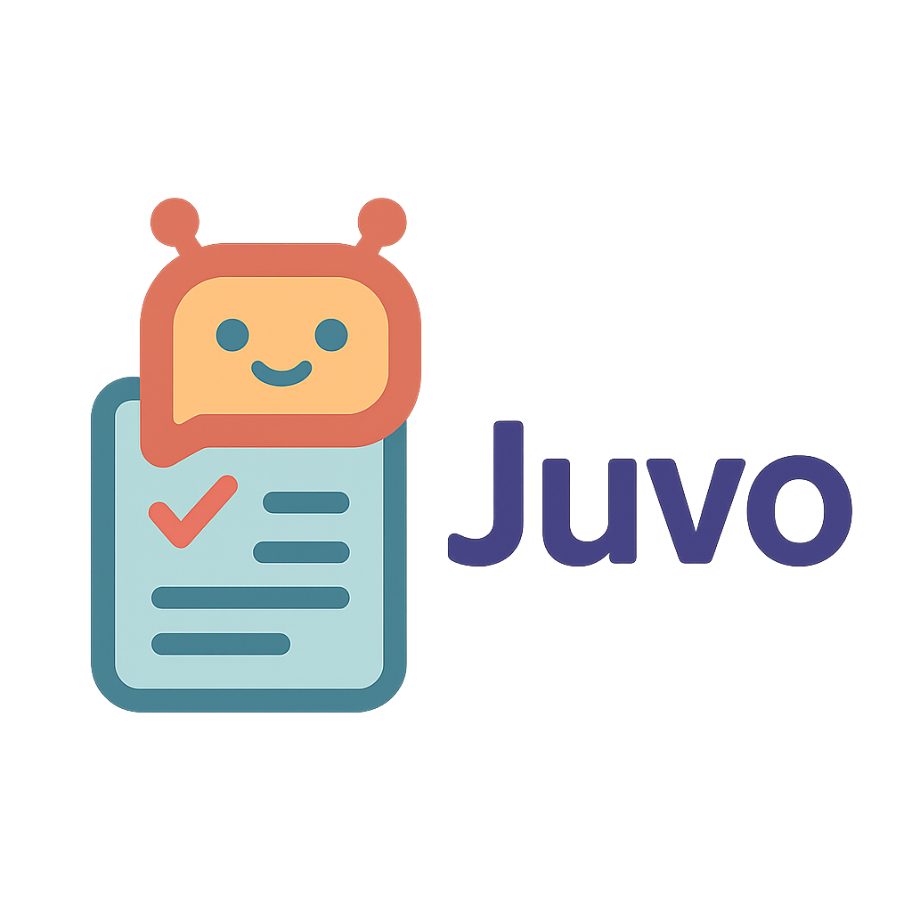

<div align="center">
  
  <h1>Juvo - AI Resume Builder</h1>
  <p>
    <strong>Build, optimize, and tailor your resume for specific job opportunities with AI assistance</strong>
  </p>
  <p>
    <a href="#features">Features</a> •
    <a href="#demo">Demo</a> •
    <a href="#getting-started">Getting Started</a> •
    <a href="#usage">Usage</a> •
    <a href="#contributing">Contributing</a> •
    <a href="#license">License</a>
  </p>
</div>

## 🚀 About Juvo

Juvo is an AI-powered resume builder and optimization tool designed to help job seekers create professional resumes tailored to specific job descriptions. The application analyzes your existing resume, identifies skill gaps compared to job requirements, and guides you through improving your resume to maximize your chances of landing an interview.

### Why Juvo?

- **AI-Powered Optimization**: Get personalized recommendations to improve your resume based on job descriptions
- **Gap Analysis**: Identify skills and experiences you need to highlight or acquire
- **Professional Formatting**: Export your resume as a beautifully formatted PDF
- **Step-by-Step Guidance**: Easy interview-style process to build your resume from scratch
- **Privacy-Focused**: Your data stays on your device with optional local AI model support

## ✨ Features

- **Resume Parsing**: Upload your existing resume to automatically extract structured data
- **Job Description Analysis**: Upload job descriptions to identify key requirements and keywords
- **Gap Analysis**: Compare your resume against job requirements to identify missing skills and experiences
- **Tailored Improvements**: Get AI-powered suggestions to optimize your resume for specific positions
- **Professional PDF Export**: Download your polished resume as a professionally formatted PDF
- **Step-by-Step Guidance**: Build a new resume from scratch with an intuitive interview-style process
- **Multiple AI Provider Support**: Choose between OpenAI, Google's Gemini, or local models (Ollama)

## 🖼️ Demo

### Master Resume Hub


### Resume Gap Analysis


### Resume Tailoring


### Final Resume with Download Option


## 🚦 Getting Started

First, run the development server:

```bash
npm run dev
# or
yarn dev
# or
pnpm dev
# or
bun dev
```

Open [http://localhost:3000](http://localhost:3000) with your browser to see the result.

You can start editing the page by modifying `app/page.tsx`. The page auto-updates as you edit the file.

This project uses [`next/font`](https://nextjs.org/docs/app/building-your-application/optimizing/fonts) to automatically optimize and load [Geist](https://vercel.com/font), a new font family for Vercel.

## Running with a Local AI (Ollama)

To run the application with a local AI model using Ollama, follow these steps:

1.  **Start the `docling` Docker container:**

    ```bash
    docker run -d -p 3001:3001 --name docling ghcr.io/zelip/docling:latest
    ```

2.  **Run the Ollama model:**

    First, ensure you have Ollama installed. Then, pull and run a model. We recommend `gemma:2b` for a balance of performance and resource usage, but you can use other models.

    ```bash
    ollama run gemma:2b
    ```

3.  **Configure Environment Variables:**

    Create a `.env.local` file in the root of the project and add the following line to it. This tells the application to use the local Ollama-compatible endpoint.

    ```
    AI_PROVIDER=ollama
    ```

4.  **Start the development server:**

    ```bash
    npm run dev
    ```

## Learn More

To learn more about Next.js, take a look at the following resources:

- [Next.js Documentation](https://nextjs.org/docs) - learn about Next.js features and API.
- [Learn Next.js](https://nextjs.org/learn) - an interactive Next.js tutorial.

You can check out [the Next.js GitHub repository](https://github.com/vercel/next.js) - your feedback and contributions are welcome!

## 🎮 Usage

1. **Upload Your Resume** or start from scratch with the interview process
2. **Enter a Job Description** you want to tailor your resume for
3. **Review the Gap Analysis** to see where your resume needs improvement
4. **Address each identified gap** by adding relevant skills and experiences
5. **Download your optimized resume** as a professionally formatted PDF

## 📋 Environment Setup

Juvo supports multiple AI providers. Configure your preferred provider in the `.env.local` file:

```bash
# Choose one: openai, google, or ollama
AI_PROVIDER=openai

# If using OpenAI
OPENAI_API_KEY=your_openai_api_key

# If using Google Gemini
GOOGLE_API_KEY=your_google_api_key

# Local endpoint configuration (if needed)
LOCAL_AI_BASE_URL=http://localhost:11434/v1
```

## 🤝 Contributing

Contributions are welcome and appreciated! Here's how you can contribute:

1. Fork the repository
2. Create a feature branch (`git checkout -b feature/amazing-feature`)
3. Commit your changes (`git commit -m 'Add some amazing feature'`)
4. Push to the branch (`git push origin feature/amazing-feature`)
5. Open a Pull Request

Please ensure your code follows the project's style guidelines and includes appropriate tests.

## 📄 License

This project is licensed under the MIT License - see the [LICENSE](LICENSE) file for details.

## 🙏 Acknowledgements

- [Next.js](https://nextjs.org/) - The React framework used
- [OpenAI](https://openai.com/) - AI model provider
- [Google Gemini](https://ai.google.dev/) - AI model provider
- [Ollama](https://ollama.ai/) - Local AI model support

## 📬 Contact

Have questions or feedback? Reach out through [GitHub issues](https://github.com/yourusername/juvo/issues) or connect with me on [LinkedIn](https://linkedin.com/in/yourusername).

---

<p align="center">Made with ❤️ for job seekers everywhere</p>
